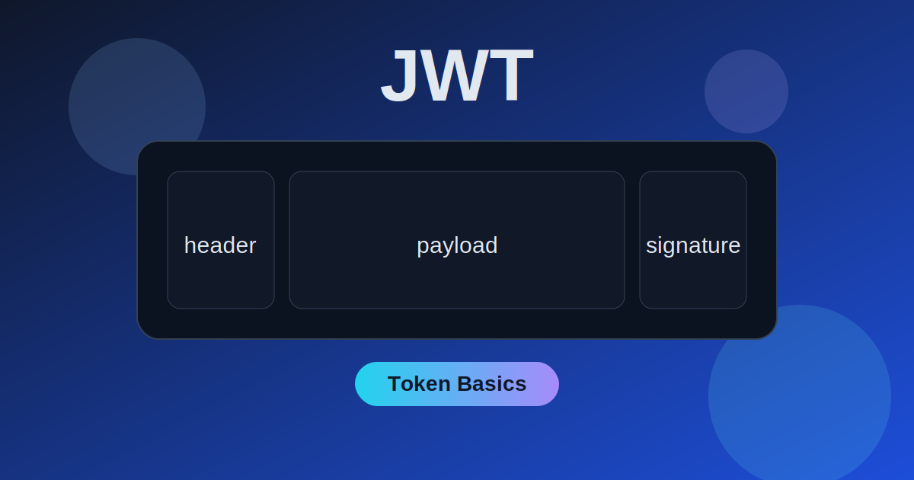

JWT (JSON Web Token) is one of the most common token formats used in APIs.

This post focuses on the **core JWT technology** and practical usage.

> We will **not** go deep into cryptography internals (math, RSA internals, ASN.1 details).  
> We will stay focused on the JWT flow: **create token -> send token -> verify token**.



## Table of contents

- [What is JWT?](#what-is-jwt)
- [Key points to remember](#key-points-to-remember)
- [JWT types (by signing style)](#jwt-types-by-signing-style)
  - [1) Symmetric JWT (HS256)](#1-symmetric-jwt-hs256)
  - [2) Asymmetric JWT (RS256)](#2-asymmetric-jwt-rs256)
- [Minimal JWT flow](#minimal-jwt-flow)
- [Python sample: Symmetric JWT (HS256)](#python-sample-symmetric-jwt-hs256)
- [Python sample: Asymmetric JWT (RS256)](#python-sample-asymmetric-jwt-rs256)
- [When to use JWT](#when-to-use-jwt)
- [Practical recommendation](#practical-recommendation)
- [Final takeaways](#final-takeaways)

## What is JWT?

JWT is a signed token with this structure:

`header.payload.signature`

- `header`: metadata like algorithm (`alg`) and token type (`typ`)
- `payload`: claims (for example `sub`, `exp`, `iat`)
- `signature`: proof that header+payload were not modified

JWT is usually sent as:

`Authorization: Bearer <token>`

## Key points to remember

- JWT is a **token format**, not a login system.
- JWT is **signed**, not encrypted by default.
- JWT payload can be decoded by anyone who has the token.
- JWT should usually be **short-lived** for security.

## JWT types (by signing style)

### 1) Symmetric JWT (`HS256`)

- Same shared secret is used for both sign and verify.
- Good for simple single-service setups.
- Risk: if verifier has secret, verifier can also mint tokens.

### 2) Asymmetric JWT (`RS256`)

- Private key signs.
- Public key verifies.
- Good when one issuer and many verifiers/services.

## Minimal JWT flow

1. User authenticates.
2. Server creates JWT and returns it.
3. Client sends JWT in API calls.
4. API verifies JWT signature and claims.
5. If valid, request is authorized.

## Python sample: Symmetric JWT (HS256)

```python
import base64
import hmac
import hashlib
import json


def b64url_encode(data: bytes) -> str:
    return base64.urlsafe_b64encode(data).decode().rstrip("=")


def b64url_decode(data: str) -> bytes:
    return base64.urlsafe_b64decode(data + "=" * (-len(data) % 4))


def create_jwt(secret: str, payload: dict, header: dict | None = None) -> str:
    if header is None:
        header = {"alg": "HS256", "typ": "JWT"}

    header_b64 = b64url_encode(json.dumps(header, separators=(",", ":")).encode())
    payload_b64 = b64url_encode(json.dumps(payload, separators=(",", ":")).encode())
    message = f"{header_b64}.{payload_b64}".encode()

    signature = hmac.new(secret.encode(), message, hashlib.sha256).digest()
    signature_b64 = b64url_encode(signature)

    return f"{header_b64}.{payload_b64}.{signature_b64}"


def verify_jwt(secret: str, token: str) -> dict:
    header_b64, payload_b64, signature_b64 = token.split(".")
    message = f"{header_b64}.{payload_b64}".encode()

    expected_sig = hmac.new(secret.encode(), message, hashlib.sha256).digest()
    expected_b64 = b64url_encode(expected_sig)

    if not hmac.compare_digest(expected_b64, signature_b64):
        raise ValueError("Signature mismatch")

    return json.loads(b64url_decode(payload_b64).decode())


if __name__ == "__main__":
    secret = "my-secret"
    payload = {"sub": "user-123", "role": "reader"}

    token = create_jwt(secret, payload)
    print("token:", token)

    decoded = verify_jwt(secret, token)
    print("decoded:", decoded)
```

## Python sample: Asymmetric JWT (RS256)

> This example uses `cryptography` package and still keeps crypto internals abstract.

```python
import base64
import json
from cryptography.hazmat.primitives import hashes
from cryptography.hazmat.primitives.asymmetric import rsa, padding


def b64url_encode(data: bytes) -> str:
    return base64.urlsafe_b64encode(data).decode().rstrip("=")


def b64url_decode(data: str) -> bytes:
    return base64.urlsafe_b64decode(data + "=" * (-len(data) % 4))


def create_jwt(private_key, payload: dict, header: dict | None = None) -> str:
    if header is None:
        header = {"alg": "RS256", "typ": "JWT"}

    header_b64 = b64url_encode(json.dumps(header, separators=(",", ":")).encode())
    payload_b64 = b64url_encode(json.dumps(payload, separators=(",", ":")).encode())
    message = f"{header_b64}.{payload_b64}".encode()

    signature = private_key.sign(message, padding.PKCS1v15(), hashes.SHA256())
    signature_b64 = b64url_encode(signature)

    return f"{header_b64}.{payload_b64}.{signature_b64}"


def verify_jwt(public_key, token: str) -> dict:
    header_b64, payload_b64, signature_b64 = token.split(".")
    message = f"{header_b64}.{payload_b64}".encode()
    signature = b64url_decode(signature_b64)

    public_key.verify(signature, message, padding.PKCS1v15(), hashes.SHA256())
    return json.loads(b64url_decode(payload_b64).decode())


if __name__ == "__main__":
    private_key = rsa.generate_private_key(public_exponent=65537, key_size=2048)
    public_key = private_key.public_key()

    payload = {"sub": "user-123", "scope": "read:posts"}
    token = create_jwt(private_key, payload)
    print("token:", token)

    decoded = verify_jwt(public_key, token)
    print("decoded:", decoded)
```

## When to use JWT

JWT is a good fit when:

- you have multiple services that need local token verification
- you want low-latency auth checks without central session lookup on every call
- you can use short access-token lifetimes

JWT is not ideal when:

- immediate revocation on every request is mandatory
- you plan to store sensitive/private data directly in payload

## Practical recommendation

Use this model in most API systems:

- **short-lived JWT access token** (for API calls)
- **long-lived refresh token** (only for token refresh endpoint)

This gives fast API auth and safer session continuity.

## Final takeaways

- JWT = compact, signed token format.
- Focus on **signature verification + claim validation**.
- Start with HS256 for learning, use RS256 when architecture grows.
- Keep tokens short-lived and treat them as secrets.
